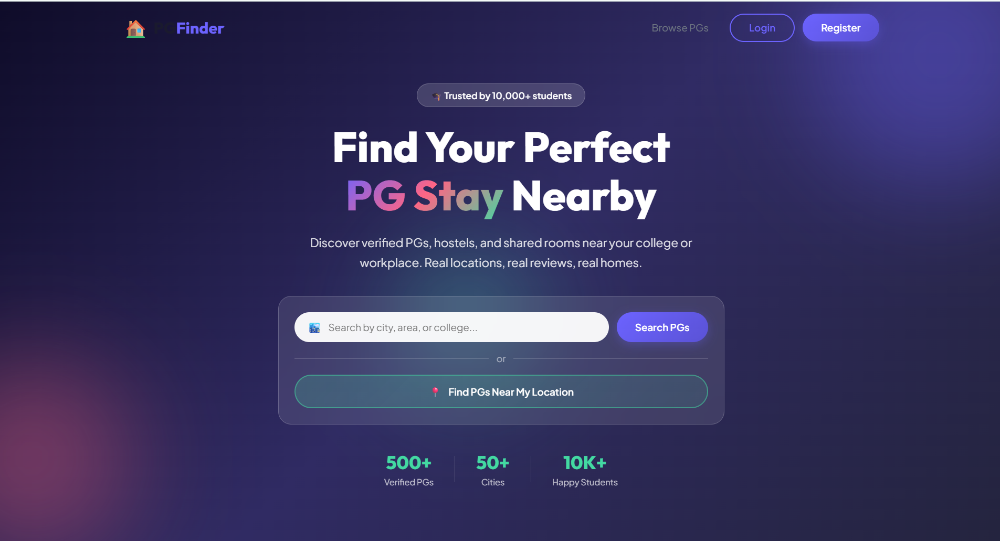
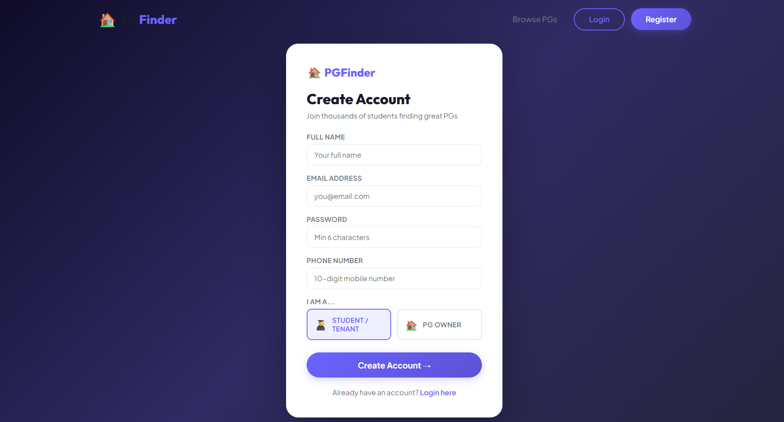
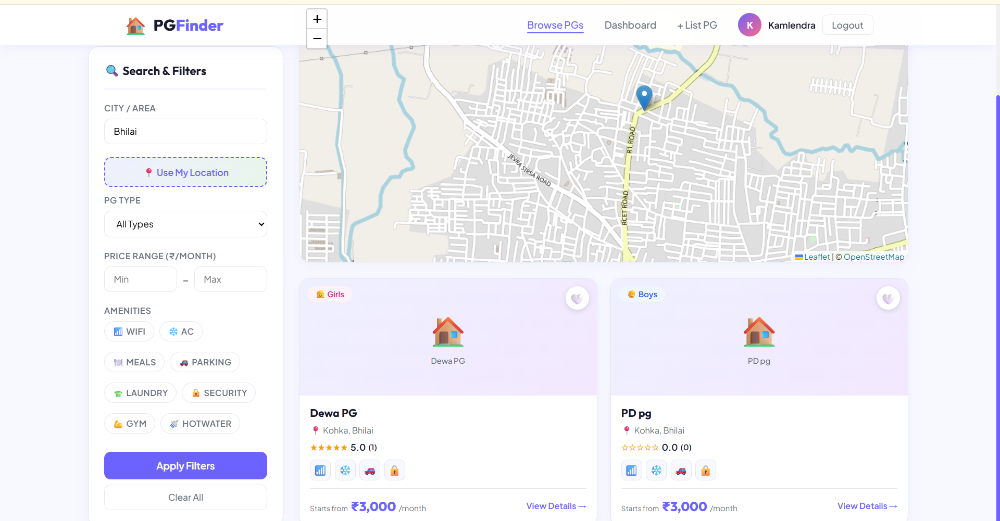
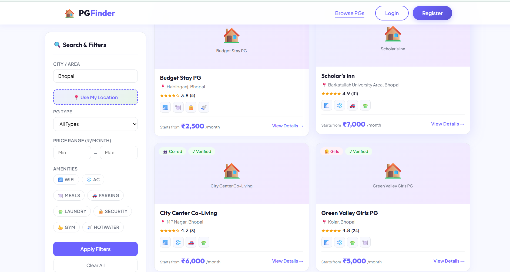

# 🏠 PG Finder — Find PGs Near You

A full-stack web application that helps students find PG (Paying Guest) accommodations near their college or current location using live GPS tracking and geospatial search.

🌐 **Live Demo:** [pg-finder-4l6c.vercel.app](https://pg-finder-4l6c.vercel.app)

---

## ✨ Features

- 📍 **Live Location Search** — Find PGs within a custom radius using real-time GPS
- 🗺️ **Interactive Map** — OpenStreetMap powered map with PG markers and distance circles
- 🔍 **Advanced Filters** — Filter by city, PG type (Boys/Girls/Co-ed), price range, and amenities
- ✅ **Verified Listings** — PG owners can list and manage their properties
- ⭐ **Reviews & Ratings** — Students can leave reviews on PGs they've stayed at
- 🔐 **JWT Authentication** — Secure login/register for students and PG owners
- 📊 **Owner Dashboard** — PG owners can add, edit, and manage their listings
- 📱 **Responsive Design** — Works on desktop and mobile

---

## 🛠️ Tech Stack

**Frontend**
- React 18
- React Router v6
- Leaflet / React Leaflet (maps)
- Axios
- CSS3

**Backend**
- Node.js + Express
- MongoDB Atlas + Mongoose
- JWT Authentication
- Geospatial queries with `$geoNear`

**Deployment**
- Frontend → Vercel
- Backend → Render
- Database → MongoDB Atlas

---

## 🚀 Getting Started

### Prerequisites
- Node.js v16+
- MongoDB Atlas account

### 1. Clone the repo
```bash
git clone https://github.com/Vickykumar03/PG-Finder.git
cd PG-Finder
```

### 2. Setup Backend
```bash
cd backend
cp .env.example .env
# Fill in your MONGO_URI and JWT_SECRET in .env
npm install
npm run dev
```

### 3. Setup Frontend
```bash
cd frontend
cp .env.example .env
# Set REACT_APP_API_URL=http://localhost:5000/api
npm install
npm start
```

### 4. Seed Demo Data
```bash
cd backend
node seed.js
```

**Demo Accounts:**
| Role | Email | Password |
|------|-------|----------|
| Student | student@pgfinder.com | password123 |
| Owner 1 | owner1@pgfinder.com | password123 |
| Owner 2 | owner2@pgfinder.com | password123 |

---

## 📁 Project Structure

```
PG-Finder/
├── backend/
│   ├── config/         # DB connection
│   ├── middleware/      # Auth middleware
│   ├── models/          # Mongoose schemas (User, PG)
│   ├── routes/          # API routes (auth, pgs)
│   ├── seed.js          # Demo data seeder
│   └── server.js        # Express app entry point
│
├── frontend/
│   ├── public/
│   └── src/
│       ├── components/  # Navbar, PGCard
│       ├── context/     # Auth context
│       └── pages/       # Home, Search, PGDetail, Dashboard, etc.
```

---

## 🔌 API Endpoints

| Method | Endpoint | Description |
|--------|----------|-------------|
| POST | `/api/auth/register` | Register new user |
| POST | `/api/auth/login` | Login user |
| GET | `/api/pgs` | Get all PGs (with city/type filter) |
| GET | `/api/pgs/nearby` | Get PGs near a location (GPS) |
| GET | `/api/pgs/:id` | Get single PG details |
| POST | `/api/pgs` | Create new PG listing (owner only) |
| PUT | `/api/pgs/:id` | Update PG listing (owner only) |
| DELETE | `/api/pgs/:id` | Delete PG listing (owner only) |
| POST | `/api/pgs/:id/reviews` | Add review to PG |
| GET | `/api/pgs/owner/my-pgs` | Get owner's listings |

---

## 🌍 Deployment

### Backend (Render)
1. Create a Web Service on [render.com](https://render.com)
2. Set Root Directory to `backend`
3. Build Command: `npm install`
4. Start Command: `node server.js`
5. Add environment variables: `MONGO_URI`, `JWT_SECRET`, `NODE_ENV=production`

### Frontend (Vercel)
1. Import repo on [vercel.com](https://vercel.com)
2. Set Root Directory to `frontend`
3. Add environment variable: `REACT_APP_API_URL=https://your-render-url.onrender.com/api`

---

## 📸 Screenshots

| search | Register & Login|
|-------|----------|
|  |  |

| Home Page | Other Searches & Map |
|-----------|--------------|
|  |  |


---

## 📄 License

MIT License — feel free to use and modify.

---

Made with ❤️ by [Vicky Kumar](https://github.com/Vickykumar03)
